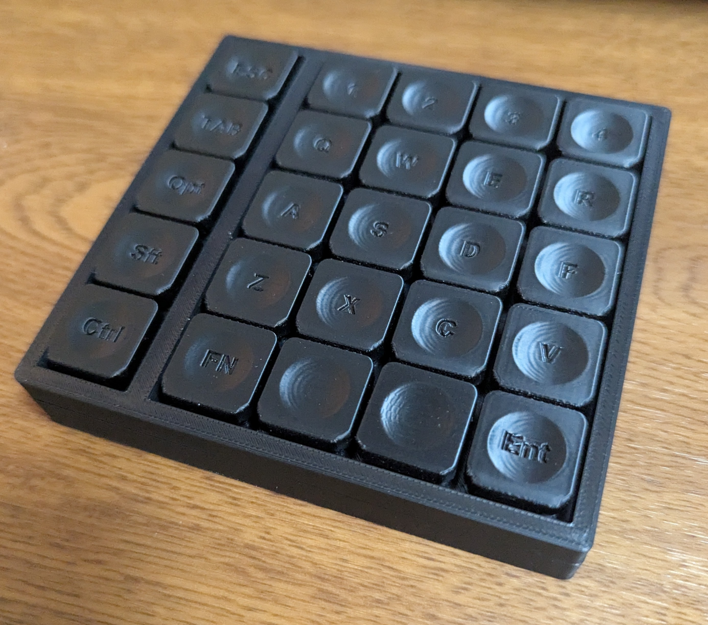

# FF Pad
I like playing games, so I use a gaming keyboard.
However, there are many keys on a keyboard that I don't need, so I made a small pad that lets me use only the keys I need.

It's a macro pad with 5*5 keys, so it's Five * Five Macro Pad, and I named it FF Pad.
By the way, I also play FINAL FANTASY XIV, and use it almost exclusively as a pad.

*A short description of the keyboard/project*

* Keyboard Maintainer: [Taroken](https://github.com/Tratoken/)
* Hardware Availability: 

* 3D Print Data
[Maker World FF Pad](https://makerworld.com/en/models/1616425-ff-pad#profileId-1705767)

Make example for this keyboard (after setting up your build environment):

    make ffpad:vial

Flashing example for this keyboard:

    make ffpad:vial:flash

See the [build environment setup](https://docs.qmk.fm/#/getting_started_build_tools) and the [make instructions](https://docs.qmk.fm/#/getting_started_make_guide) for more information. Brand new to QMK? Start with our [Complete Newbs Guide](https://docs.qmk.fm/#/newbs).

## Bootloader

Enter the bootloader in 1 ways:

* **Bootmagic reset**: Hold down the key at (0,0) in the matrix (usually the top left key or Escape) and plug in the keyboard

