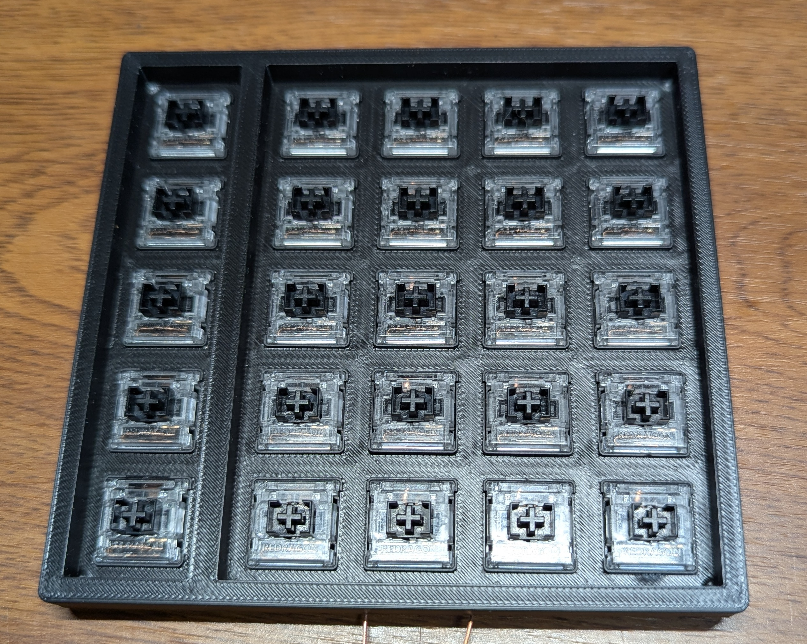
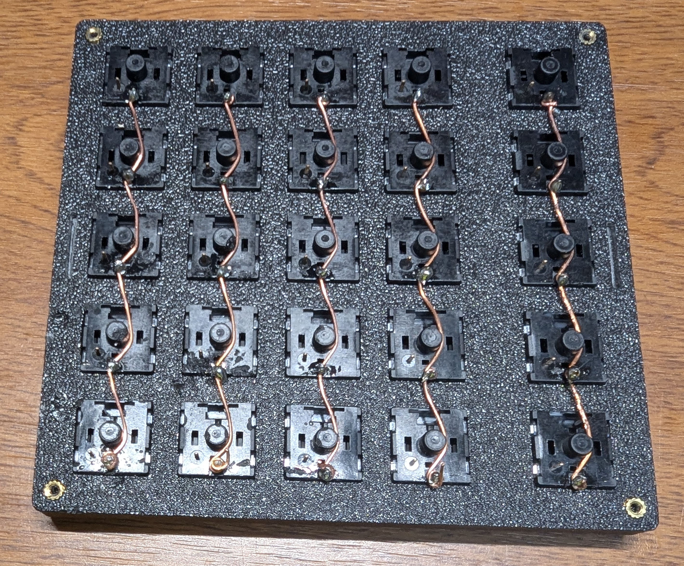
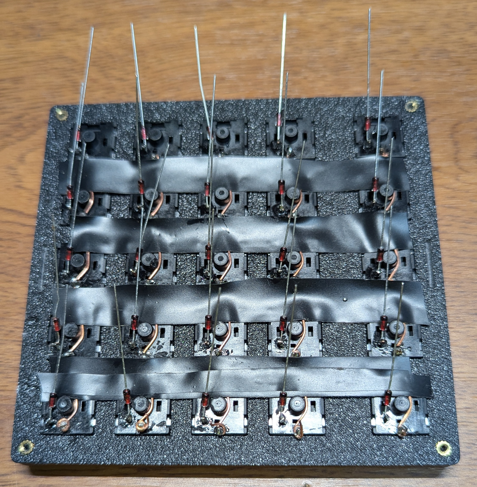
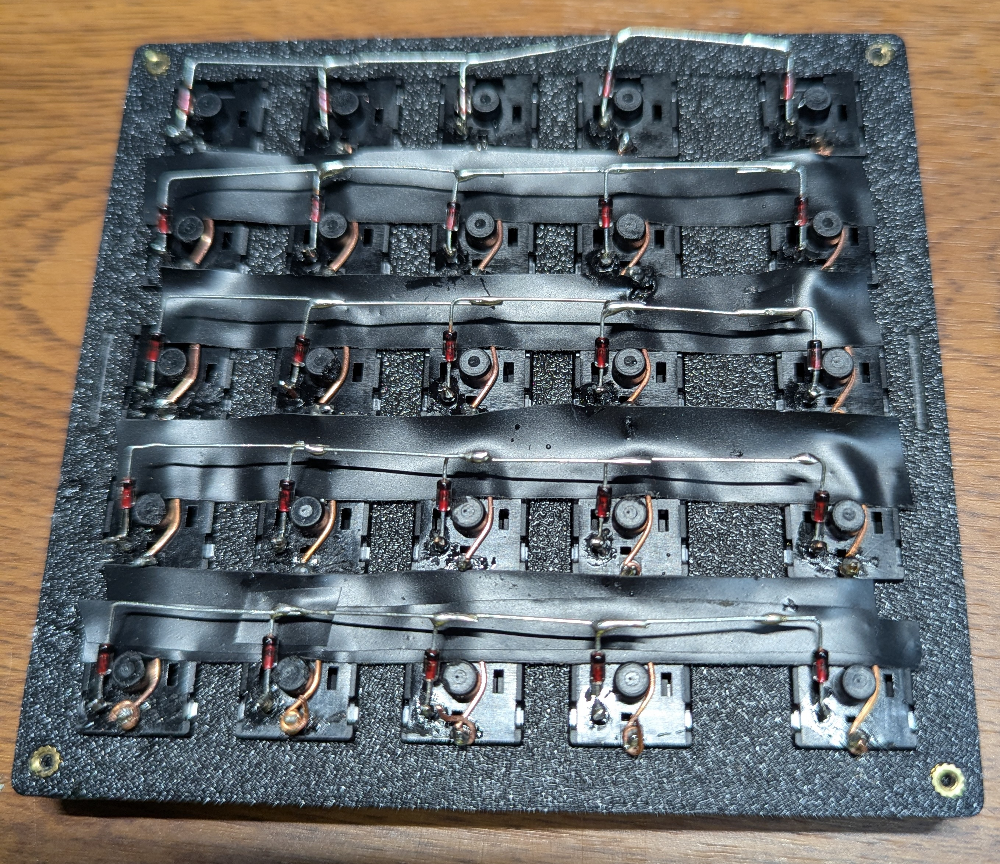
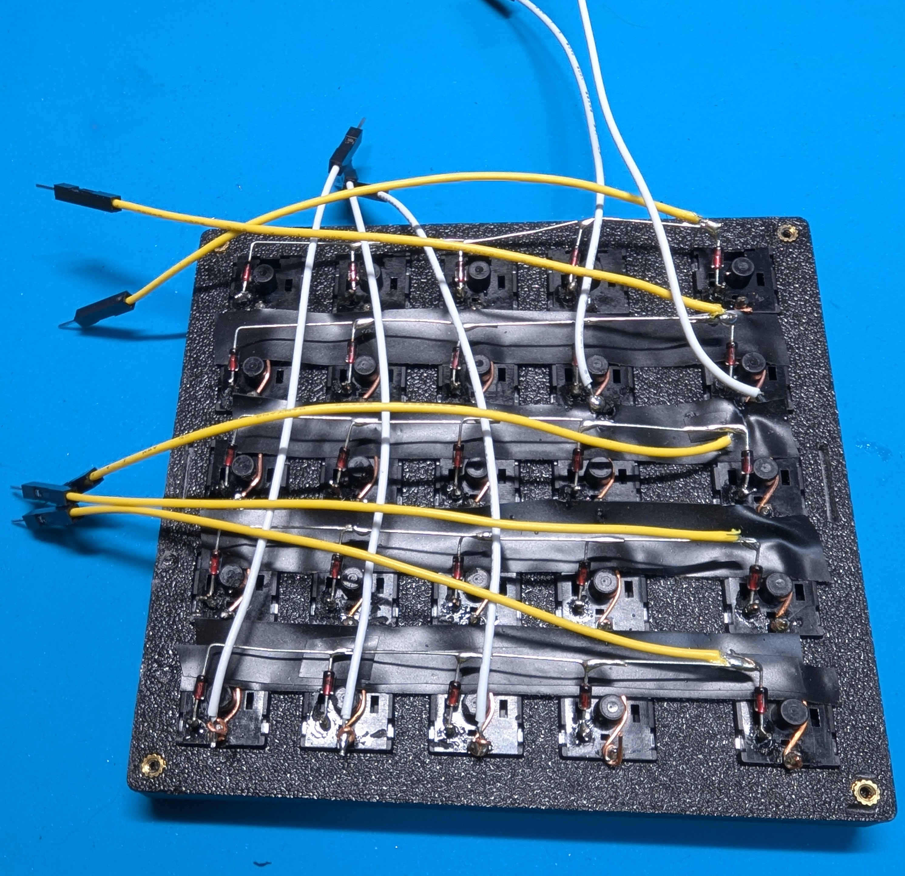

# FF Pad
I like playing games, so I use a gaming keyboard. 
However, there are many keys on a keyboard that I don't need, so I made a small pad that lets me use only the keys I need. 
Since there are only a few keys, I didn't make a PCB but instead hand-wired them.
Soldering is quite a hassle, but if you have a 3D printer, you can make it using easily available materials.

It's a macro pad with 5*5 keys, so it's Five * Five Macro Pad, and I named it FF Pad. 
By the way, I also play FINAL FANTASY XIV, and use it almost exclusively as a pad.

The RP2024-Zero LEDs are lit up by layer.
* Layer 0: Blue
* Layer 1: Red
* Layer 2: Green
* Layer 3: White

Using transparent key switches and key caps allows you to identify which layer is which by color.

## Bill Of Materials
* 25 x diodes 1N4148
* 25 x Mechanical switches
* 25 x keycaps of choice
* 1 x RP2024-Zero
* 24 AWG (0.2 mm2) wire
* 4 x M2x3x3.5 OD heat inserts
* 4 x M2x10 Allen head screws
* Enameled wire 0.6mm 50cm
* 3D Print Parts Data
[Maker World FF Pad](https://makerworld.com/en/models/1616425-ff-pad#profileId-1705767)

## Wiring

## Handwiring guide
1. The top and bottom parts are printed using the 3D printing data.

2. Once printed, attach the mechanical switch to the top part.

3. Turn the assembled parts over and wrap enamel wire around the right leg of each switch, then solder it in place.

4. Once soldered, apply insulating tape.

5. Attach a diode to the left leg of each switch. Bend the anode wire and solder it along the switch leg.

6. Once soldered, bend the cathode line sideways and solder it to the adjacent diode.

7. Attach the AWG wire to the COLS (enameled wire) and ROWS (diodes). In the image, the white is the COLS and the yellow is the ROWS.
Since it is flipped, the top right is (0,0) and the bottom left is (5,5).

8. Solder the COLS and ROWS lines to the RP2024.

9. To write the firmware, press the boot button, press the Reset button, and then speak at the same time. If successful, the RP2040-Zero will be mounted on your computer and Explorer will open, so drag and drop the firmware file to write it.
Explorer will automatically close when writing is successful.

10. Go to the Vial (https://vial.rocks/) website and make sure that your FF Pad is recognized. Click Start Vial on the screen to connect and you will be able to change the keymap.
Use a matrix tester to check that each switch works properly.

11. Install heat inserts into the four corners of the top part.

12. Screw the bottom part in place and it's complete.

## Keymap
* Layer 0 

* Layer 1 

* You can set up to four layers.

## If you want to customize the firmware yourself
The Vial configuration file is in keymap/vial.

Make example for this keyboard (after setting up your build environment):

    make ffpad:vial

Flashing example for this keyboard:

    make ffpad:vial:flash

See the [build environment setup](https://docs.qmk.fm/#/getting_started_build_tools) and the [make instructions](https://docs.qmk.fm/#/getting_started_make_guide) for more information. Brand new to QMK? Start with our [Complete Newbs Guide](https://docs.qmk.fm/#/newbs).

## Bootloader
* **Bootmagic reset**: Hold down the key at (0,0) in the matrix (usually the top left key or Escape) and plug in the keyboard